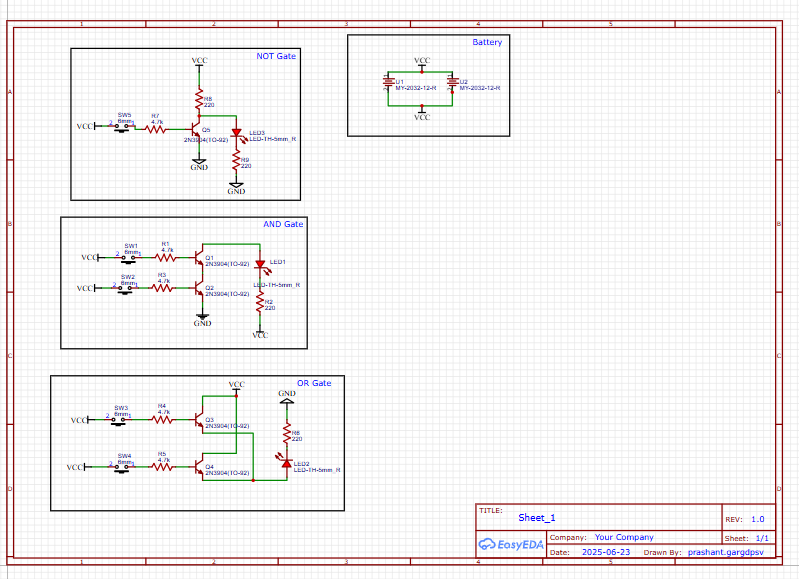
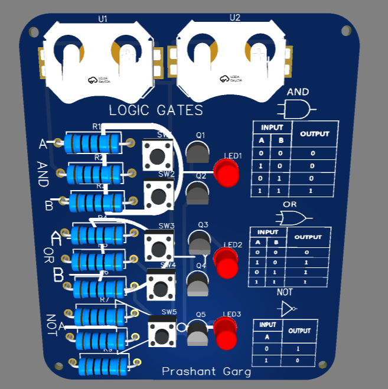
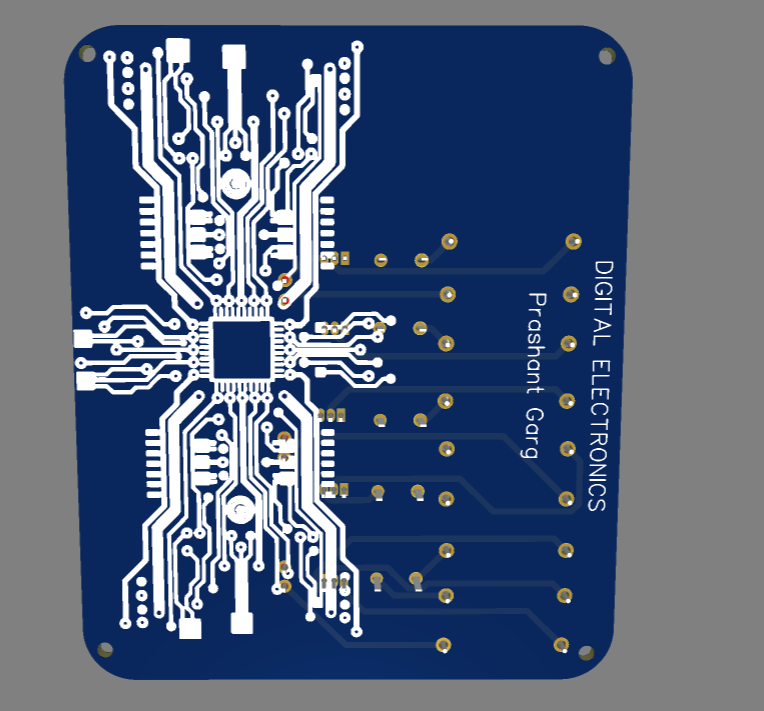
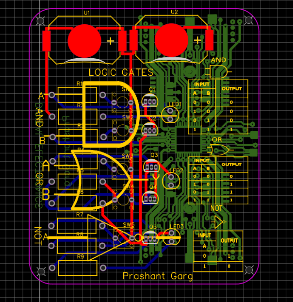

# 🔌 Logic Gate Trainer PCB – Transistor-Based Educational Board

This project is a **DIY PCB Trainer Board** designed to help learners understand the working of basic **digital logic gates** — AND, OR, and NOT — using only **transistors and common components**, with **no ICs involved**. Perfect for electronics students, hobbyists, and makers who want to **visualize logic gate behavior** in a hands-on way.

---

## 📁 Repository Contents

---

## 🧾 Bill of Materials (BOM)

| ID | Name       | Designator     | Footprint       | Quantity |
| -- | ---------- | -------------- | --------------- | -------- |
| 1  | LED-TH-5mm | LED1, LED2     | LED-TH\_BD5mm   | 3        |
| 2  | 2N3904(T)  | Q1, Q2, Q3     | TO-92-3\_Legacy | 5        |
| 3  | 4.7k       | R1, R3, R4, R7 | R\_AXIAL-0.3    | 5        |
| 4  | 220        | R2, R6, R8, R9 | R\_AXIAL-0.3    | 5        |
| 5  | 6mm Switch | SW1, SW2       | SWITCH\_TACT    | 5        |
| 6  | MY-2032-1  | U3, U4         | BAT-SMD\_2032   | 2        |

📝 *Full BOM is available in the `BOM.csv` file.*

---

## ⚙️ Tools & Software Used

- ✅ [EasyEDA](https://easyeda.com/) – for schematic and PCB design
- ✅ Schematic capture & PCB layout in one tool
- ✅ 3D Preview & Gerber file export

---

## 🔋 Power Supply

- Powered by **2x CR2032 coin cells**
- VCC and GND buses are clearly marked
- No external power source required

---

## 🛠️ How to Use

1. **Download and open** the `Project.json` or Gerber files in EasyEDA.
2. **Check the schematic** and layout for logic gate implementations.
3. **Fabricate the PCB** using the Gerber files.
4. **Solder the components** as per the silkscreen and schematic.
5. **Insert CR2032 batteries** and press input switches to see the LEDs respond according to logic.

---

## 🎓 Educational Value

- Visual demonstration of Boolean logic
- Perfect for labs, demos, and workshops
- Low-cost, component-level logic trainer
- Promotes understanding of basic transistor switching

---

## 📷 Preview

### 🖥 Schematic Diagram

### 🟢 PCB Front View

### 🔵 PCB Back View

### 🔷 PCB Model

---

## 📄 License

This project is licensed under the MIT License – feel free to fork, modify, and learn from it.

---

